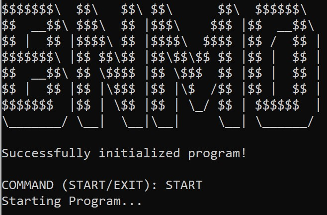

# BNMO
Disusun untuk Tugas Besar IF2110 Algoritma dan Struktur Data

## Daftar Isi
* [Penjelasan Ringkas Program](#penjelasan-ringkas-program)
* [Cara Kompilasi Program](#cara-kompilasi-program)
* [Cara Menjalankan Program](#cara-menjalankan-program)
* [Screenshot program](#screenshot-program)
* [Daftar Fitur](#daftar-fitur)
* [Struktur Program](#struktur-program)
* [Pembagian Tugas](#pembagian-tugas)

## Penjelasan Ringkas Program
BNMO secara garis besar merupakan simulator yang berfungsi utama pada pengolahan makanan. Simulator akan memiliki peta untuk menyimulasikan lokasi BNMO. Inventory untuk menyimulasikan tempat penyimpanan makanan. Di dalam simulator dapat melakukan aksi-aksi tertentu sesuai tempat adjacent-nya yang bertujuan untuk mengolah makanan. Aksi-aksi yang dapat dilakukan terhadap simulator berupa aksi pada pemesanan makanan, aksi pada pengolahan makanan, aksi untuk berpindah tempat, dan aksi untuk undo redo simulator.

## Cara Kompilasi Program
1. Pastikan Anda sedang berada pada directory `build` dengan : 
```shell
`cd ./build`.
```
2. Selanjutnya, untuk kompilasi pada program, jalankan :
```shell
`./main.bat`
```
3. Jika berhasil dikompilasi, maka akan terdapat `./main.exe` pada directory `build`.

## Cara Menjalankan Program
1. Pastikan Anda telah melakukan kompilasi pada program.
2. Jika ingin mengubah file konfigurasi, silahkan lansung mengubah melalui file text konfigurasi.
3. Untuk menjalankan program, jalankan :
```shell
`./main.exe`
```
4. Jika berhasil run, maka Anda akan tiba pada Tampilan Utama program.

## Screenshot Program
### Tampilan Utama Program

### Tampilan Setelah `START`

### Tampilan Setelah `EXIT`


## Daftar Fitur
1. Inisiasi
* SPLASH SCREEN
* START
* EXIT
2. Simulator
3. Makanan
* BUY
* FRY
4. Resep
5. Inventory
6. Pemesanan Bahan Makanan dan Delivery
7. Peta
8. Pengolahan Makanan
* MIX
* CHOP
* FRY
* BOIL
9. Mekanisme Waktu
10. Command-command Lain
* UNDO/REDO
* CATALOG
* COOKBOOK
11. Validasi dan Error Handling
12. Notifikasi
13. Kulkas
## Semua fitur selesai

## Struktur Program
```bash
.
│   README.md
├───ADT
│   ├───char_word_machine
│   │       charmachine.c
│   │       charmachine.h
│   │       driverCharWordMachine.bat
│   │       driverCharWordMachine.c
│   │       driverstring.bat
│   │       driverstring.c
│   │       string.c
│   │       string.h
│   │       wordmachine.c
│   │       wordmachine.h
│   │
│   ├───listdin
│   │       listdin.c
│   │       listdin.h
│   │
│   ├───list_statik
│   │       liststatik.c
│   │       liststatik.h
│   │
│   ├───list_statik_resep
│   │       liststatikresep.c
│   │       liststatikresep.h
│   │
│   ├───matrix
│   │       matrix.c
│   │       matrix.h
│   │
│   ├───sederhana
│   │       boolean.h
│   │       makanan.c
│   │       makanan.h
│   │       point.c
│   │       point.h
│   │       simulator.c
│   │       simulator.h
│   │       tesmakanan.c
│   │       tessimulator.c
│   │       waktu.c
│   │       waktu.h
│   │
│   ├───stack_queue
│   │       driver_queue.c
│   │       driver_stack.c
│   │       prioqueue.c
│   │       prioqueue.h
│   │       stack.c
│   │       stack.h
│   │
│   └───tree
│           listResepToTree.c
│           listResepToTree.h
│           tempCodeRunnerFile.c
│           tesResepToStatik.c
│           tesTree.c
│           tree.c
│           tree.h
│
├───command
│       driver_inventory_delivery.c
│       driver_undoredo.c
│       inventory_delivery.c
│       inventory_delivery.h
│       kulkas.c
│       moves.c
│       moves.h
│       pemesanan.c
│       pemesanan.h
│       pengolahan.c
│       pengolahan.h
│       tespengolahan.c
│       undoredo.c
│       undoredo.h
│
├───screenshot
│       dummy.jpg
│
└───test
        main.bat
        main.c
        main.exe
        makanan_test.txt
        peta_test.txt
        resep_test.txt
```

## Pembagian Tugas
1. Manuella Ivana Uli Sianipar / (13521051)
* 
* 
2. Melvin Kent Jonathan / (13521052)
* 
* 
* 
3. Yobel Dean Christopher / (13521067)
* 
* 
* 
4. Fajar Maulana Herawan / (13521080)
* ADT Stack / Prioqueue
* Undo/Redo
* Notification
* Inventory
* Delivery
5. Jimly Firdaus / (13521102)
* ADT Mesin Kata & Karakter
* Parser Program
* Main Program
